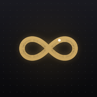
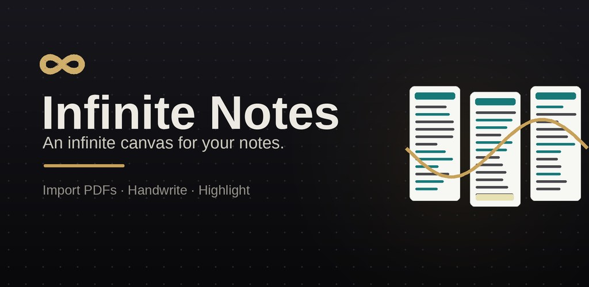
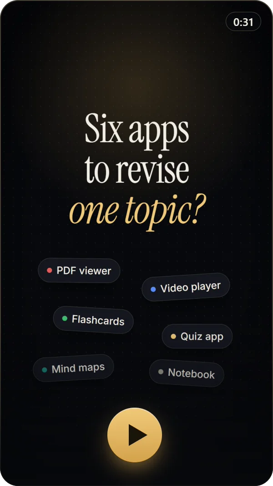
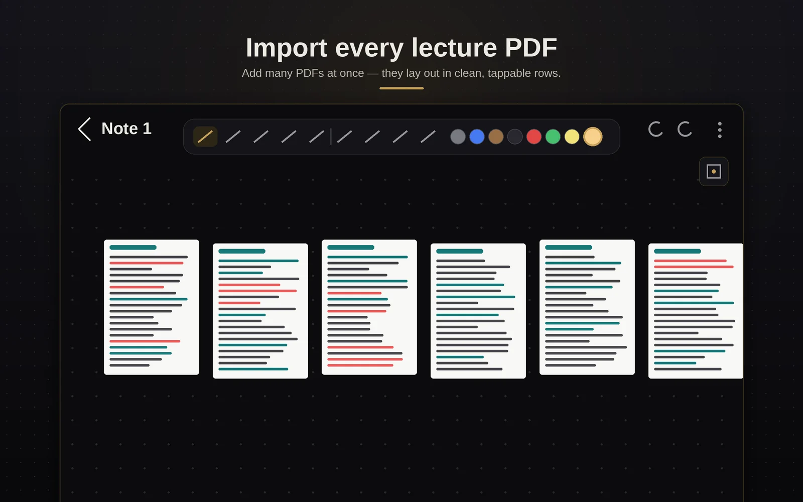
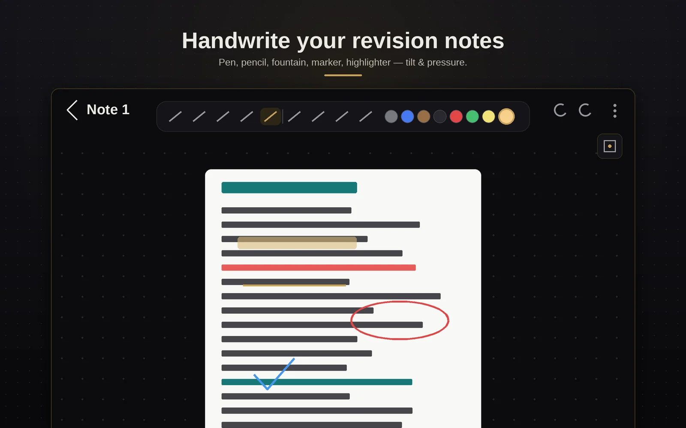
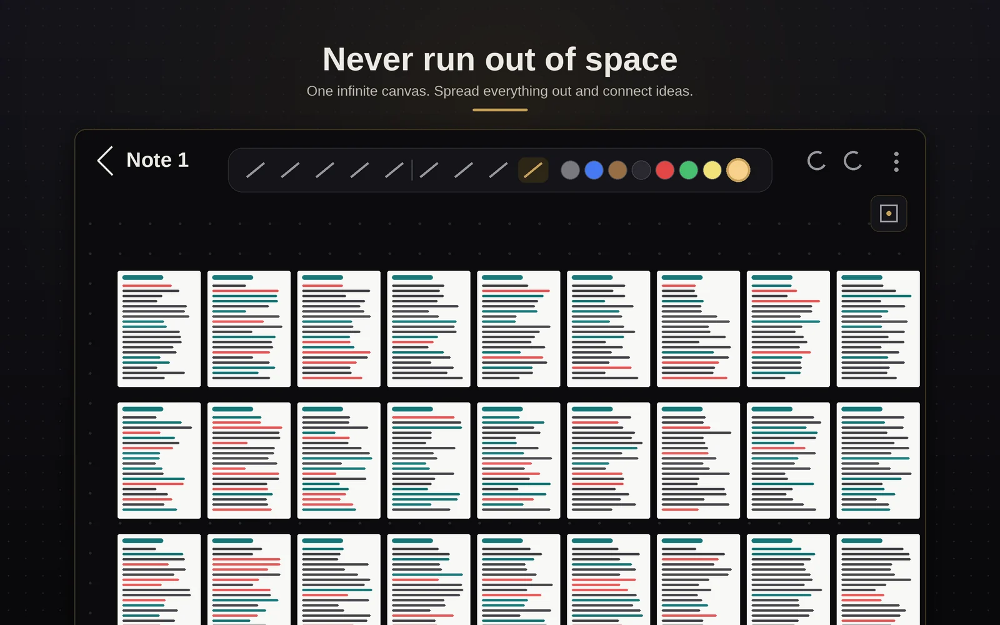

<div align="center">



# Infinite Notes

**A notebook with no edges.**
Write with a pen on a page that never runs out — with your lecture slides, videos,
quizzes and mind maps living on the same page as your handwriting.


[**Download**](#download) · [Watch](#see-it-in-30-seconds) · [What it does](#what-it-does) · [Privacy](#privacy) · [Install guides](#install-guides) · [Report a bug](https://github.com/Nobel-7-3/infinite-notes/issues/new/choose)

<br>



</div>

---

## Download

| | App | File |
|---|---|---|
| **Android tablet** | Infinite Notes 4.7 | [**InfiniteNotes-Android.apk**](https://github.com/Nobel-7-3/infinite-notes/releases/latest/download/InfiniteNotes-Android.apk) |
| **Windows laptop** | Desktop companion 3.8.1 — installer | [**InfiniteNotes-Windows-Setup.exe**](https://github.com/Nobel-7-3/infinite-notes/releases/latest/download/InfiniteNotes-Windows-Setup.exe) |
| | Desktop companion 3.8.1 — portable, no install | [InfiniteNotes-Windows-Portable.exe](https://github.com/Nobel-7-3/infinite-notes/releases/latest/download/InfiniteNotes-Windows-Portable.exe) |

Every release lists SHA-256 checksums in `SHA256SUMS.txt`, so you can check a
download is exactly the file published here. Older versions and release notes:
[**Releases**](https://github.com/Nobel-7-3/infinite-notes/releases).

The tablet app works entirely on its own. The Windows app is optional — it shows
the same notes on a big screen and syncs with the tablet over a USB cable.

## See it in 30 seconds

<div align="center">

<a href="https://nobel-7-3.github.io/infinite-notes/#watch"></a>

<sub>Tap to play the tour on the website. It has no sound, so it's fine to watch anywhere.</sub>

</div>

## What it does

<table>
<tr>
<td width="50%" valign="top">

### ✍️ Writing that feels like paper
- Pen, pencil, fountain pen, marker and highlighter — pressure and tilt aware
- Study tape to hide answers, a laser pointer for presenting
- Palm rejection: the pen draws, your finger pans
- Lasso to move ink, or **convert handwriting to typed text** (on-device)
- Shape recognition, undo/redo, quick-colour slots, paper backgrounds

</td>
<td width="50%" valign="top">

### 📚 Your whole course on one page
- Import **dozens of PDFs at once** — they lay out in tidy, tappable rows
- Import **Word documents** (`.docx`) straight onto the canvas
- Slides stay locked in place while you write over them
- **Merge one note into another** — nothing you wrote gets covered
- A minimap and zoom-to-fit to find your way around

</td>
</tr>
<tr>
<td valign="top">

### 🧠 Study material, live on the canvas
Nine kinds of material you can write over — including the files NotebookLM
exports: video and audio overviews · slide decks · reports · infographics ·
data tables · **mind maps** you can drag and fold · **flashcards** that flip ·
**quizzes** that mark your answer

</td>
<td valign="top">

### 🔒 Yours, and private
- Notes live on your device — no account, no ads, no analytics
- Lock any note behind your fingerprint
- Folders and colour tags
- Export every note to one backup file, restore it anywhere

</td>
</tr>
<tr>
<td valign="top">

### 💻 A desktop companion
The Windows app opens the same notes on a big screen and syncs with the tablet
**over a USB cable**, in the direction you choose. No network, no account —
nothing leaves your two devices.

</td>
<td valign="top">

### 🎙️ Lecture capture *(early access)*
Record a lecture on the tablet; a laptop with an NVIDIA graphics card transcribes
it and writes revision notes back onto a page. In early testing and not in the
public download yet. **Always get permission before recording** — many
universities require it.

</td>
</tr>
</table>

<div align="center">



</div>

## Install guides

- **Android tablet:** [docs/install-android.md](docs/install-android.md) — installing
  the APK, updating without losing notes, and what every button does.
- **Windows:** [docs/install-windows.md](docs/install-windows.md) — the installer,
  connecting the tablet over USB, and the optional extras.
- **Let an AI assistant do it:** open Claude Code, Antigravity, Codex, Cursor or
  Copilot and paste:

  ```text
  Read https://github.com/Nobel-7-3/infinite-notes/blob/main/AGENTS.md and install
  Infinite Notes for Windows on this computer for me. Tell me what you will download
  before you download it, check it against the published SHA-256 checksum, then
  install it and open the app.
  ```

**Updating the tablet app:** install the new APK over the old one — your notes
stay. Never uninstall first; uninstalling deletes every note on the device.

## Privacy

Infinite Notes has no servers and collects nothing. Your notes stay on your
devices. The only outside party is Google's handwriting recogniser, which runs on
the tablet and reports anonymous performance metrics to Google — never your
handwriting or your notes. Full details: [PRIVACY.md](PRIVACY.md).

## Help and feedback

- Found a bug or have an idea? [Open an issue](https://github.com/Nobel-7-3/infinite-notes/issues/new/choose).
  Please don't attach real notes or screenshots with personal information.
- Found a security problem? See [SECURITY.md](SECURITY.md) — please report it
  privately.

## About

Infinite Notes is an independent project, built by a student for studying.
The apps are free to download and use. The source code is not public.

## Legal

- [LICENSE](LICENSE) — the terms for using the apps.
- [THIRD_PARTY_NOTICES.md](THIRD_PARTY_NOTICES.md) — the open-source software
  inside them, and its licences.

<sub>Android and NotebookLM are trademarks of Google LLC. Windows is a trademark of the
Microsoft group of companies. Samsung, Galaxy and S Pen are trademarks of Samsung
Electronics Co., Ltd. Infinite Notes is an independent project and is not affiliated
with, endorsed by or sponsored by any of them.</sub>
